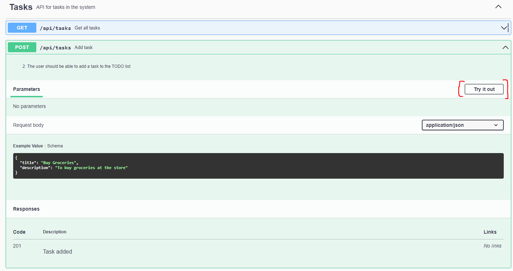

# Engineering Test

## Prepared by: Cyrus Rome Dela Cruz

### Programming Language:
1. Nodejs - Express - Typescript
### Installation steps:
1. clone repository
2. npm install
3. create .env file and copy and paste contents from .env.example
4. npm run dev -> to start dev environment
5. **Optional** (Do not run together with **npm run dev** since it uses the same PORT). **npm test** -> to execute unit testing (limited to response status codes)
---
### Swagger documentation:
1. npm run dev
2. Open browser and go to: http://localhost:3000/docs/

### Sample Sceenshots
1. Using Swagger Docs
   
   
   
   
   

2. Unit Testing results
   

3. Error response
   
   
   
   

4. Reorder
   
   
   